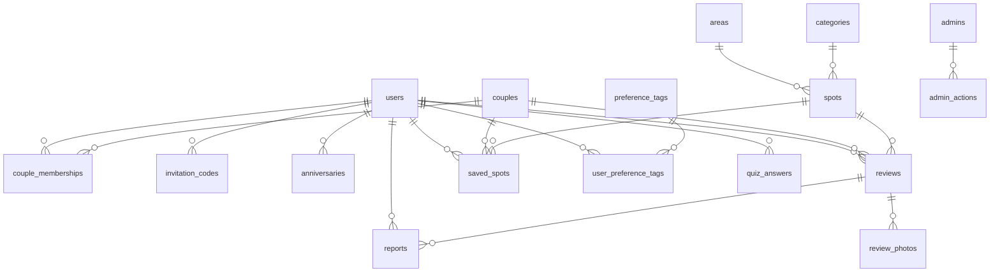

# ER図・DB設計

- **最終更新**：2026-07-31
- **前提ドキュメント**：`doc/domain-model.md`、`doc/wireframes.md`、`doc/ubiquitous-language.md`
- **本書の範囲**：どんなデータを、どうつなげて持つかを決める。エンドポイントは `doc/api-design.md` で決める

---

## ER図って何？

**「どんなデータを、どうつなげて持つか」の設計図。**

やることは2つだけ。

1. **どんな"箱"（テーブル）が必要か**を決める … ドメイン設計で洗い出した対象物がそのまま箱になる
2. **箱と箱が、どうつながるか**を決める … 「1つが何個持てるか」で考える

専門用語（1対多・多対多）は覚えなくていい。「1つがいくつ持てるか」だけ考えれば、つながりは決まる。

---

## 箱（テーブル）の一覧

ドメイン設計で洗い出した対象物が、そのまま箱になる。

| 箱（テーブル） | 何を入れるか |
| --- | --- |
| **会員** | ニックネーム・年代・居住エリア・子どもの有無・関係ステージ |
| **カップル** | 連携の状態（連携中／解除済み） |
| **連携メンバー** | 誰がどのカップルに属しているか（間に立つ箱） |
| **招待コード** | 誰が発行したコードか・有効期限・状態 |
| **記念日** | 誰の・いつの・何の記念日か |
| **スポット** | 店名・エリア・カテゴリ・位置・掲載状態 |
| **レビュー** | 評価・投稿当時のステージ・予算帯・シーン・子連れ訪問・本文 |
| **レビュー写真** | レビューに付いた写真（複数枚） |
| **保存** | どのスポットを、共有かサプライズか |
| **通報** | 誰がどのレビューを通報したか（間に立つ箱） |
| **診断回答** | 誰がどう答えたか |
| **好みタグ** | タグの一覧（マスタ） |
| **会員の好み** | 誰がどのタグを選んだか（間に立つ箱） |
| **エリア** | エリアの一覧（マスタ） |
| **カテゴリ** | カテゴリの一覧（マスタ） |
| **管理者** | 運営のアカウント。会員とは別 |
| **管理操作の記録** | 誰がいつ何を削除・停止したか |

---

## つながり方（1つが何個持てるか）

### 会員 ⇄ カップル

- 1人の会員は、**同時にはカップルを1つだけ**持てる
- ただし解除後に再び連携できるので、**過去のものを含めれば複数**
- 1つのカップルには、会員が**2人**

→ 「連携メンバー」という間に立つ箱が必要（後述）

### 会員 ⇄ 招待コード

- 1人の会員は、**有効なコードを1つだけ**持てる
- 期限切れ・使用済みを含めれば**複数**（履歴として残す）

### 会員 ⇄ 記念日

- 1人の会員は、記念日を**複数**登録できる
- 1つの記念日は、**1人**のもの（連携中はパートナーからも見える）

### 会員 ⇄ レビュー

- 1人の会員は、レビューを**何件でも**書ける
- **同じスポットに何度でも**書ける（再訪の記録）
- 1件のレビューは、**1人**が書いたもの

### カップル ⇄ レビュー

- 1つのカップルは、レビューを**何件でも**持つ
- 1件のレビューは、カップルに属することも、**属さないこともある**（ソロレビュー）

### スポット ⇄ レビュー

- 1つのスポットには、レビューが**たくさん**ぶら下がる
- 1件のレビューは、**1つ**のスポットのもの

### レビュー ⇄ レビュー写真

- 1件のレビューに、写真は**複数枚**
- 1枚の写真は、**1件**のレビューのもの

### 会員 ⇄ 保存 ⇄ スポット

- 1人の会員は、**何件でも**保存できる
- 1件の保存は、**1つ**のスポットを指す
- 共有の保存は**カップル**のもの、サプライズの保存は**本人**のもの

### エリア・カテゴリ ⇄ スポット

- 1つのエリアには、スポットが**たくさん**
- 1つのスポットは、**1つ**のエリアと**1つ**のカテゴリに属する

---

## 全体のつながり（図のイメージ）

```bash
会員 ──< 連携メンバー >── カップル      （2人で1つのカップル）
 │                          │
 │                          │
 ├──< 招待コード             ├──< レビュー >── スポット
 │                          │        │
 ├──< 記念日                │        └──< レビュー写真
 │                          │
 ├──< 診断回答              └──< 保存 >── スポット
 │
 ├──< 会員の好み >── 好みタグ
 │
 └──< 通報 >── レビュー


エリア ──< スポット
カテゴリ ──< スポット

管理者 ──< 管理操作の記録
```

※「──<」は「1つがたくさん持つ」という意味。記号自体は覚えなくてよく、「1つが何個持てるか」がわかっていればいい。

---

## 「間に立つ箱」（中間テーブル）

このサービスには、**会員と会員の間にある関係**が1つある。

### 連携メンバー

「AさんとBさんが連携している」という事実は、Aさんの箱にもBさんの箱にも入らない。**2人がセットで初めて意味を持つ**情報だから。

そこで「カップル」という箱を作り、そこに2人をぶら下げる。

```bash
会員A ──┐
        ├── 連携メンバー ── カップル
会員B ──┘
```

**なぜ「カップル」の箱と「連携メンバー」の箱の2つが要るのか。**

カップル自体が状態（連携中／解除済み）と、レビューの帰属先という役割を持つため。
「AさんとBさん」という組み合わせだけなら1つの箱で足りるが、**カップルレビューが「どちらか個人」ではなく「ふたり」に紐づく**ので、カップルを独立した箱にする必要がある。

### 他の間に立つ箱

| 箱 | 何と何をつなぐか |
| --- | --- |
| 通報 | 会員 と レビュー |
| 会員の好み | 会員 と 好みタグ |

---

## なぜ「保存」を独立した箱にするのか

「会員がスポットをお気に入りにする」だけなら、単純な間に立つ箱で済む。
しかしこのサービスの保存は、**共有かサプライズかという状態を持つ**。

さらに、持ち主が場合によって変わる。

- 共有の保存 → **カップル**のもの（パートナーにも見える）
- サプライズの保存 → **本人**のもの（パートナーには見えない）

そのため、保存の箱は「どのスポットか」に加えて、**「誰のものか」と「どちらのモードか」**を持つ。

**ここがこのサービスで最も壊れやすい箇所。** 持ち主を1つに固定すると、サプライズがパートナーに見えるか、共有が成立しないかのどちらかになる。

---

## 選択肢をどう持つか（未決事項#12の決定）

選択肢には2種類ある。**運用中に増えるかどうか**で分ける。

| 項目 | 持ち方 | 理由 |
| --- | --- | --- |
| **関係ステージ** | 列挙型 | 5つで固定。増えない |
| **予算帯** | 列挙型 | 区分が変わるのは仕様変更。コードで管理する方が確実 |
| **シーン** | 列挙型 | 運用中に増やす想定がない |
| **子連れ訪問** | 真偽値 | 連れて行ったか否かの2択 |
| **保存の可視性** | 列挙型 | 共有／サプライズの2択 |
| **エリア** | **マスタテーブル** | スポットの追加とともに増える。管理画面から足せる必要がある |
| **カテゴリ** | **マスタテーブル** | 同上 |
| **好みタグ** | **マスタテーブル** | 同上 |

### 決めた選択肢

**関係ステージ**：交際初期 / 交際中期 / 婚約中 / 新婚 / 夫婦 / 未設定

**予算帯（ふたり合計・税込）**：〜3千円 / 〜5千円 / 〜1万円 / 〜2万円 / 〜3万円 / 3万円超

**シーン**：記念日 / いつものデート / 初デート / 誕生日 / 両家・家族と / その他

**エリアの粒度**：市区町村より細かい単位（例：代官山、恵比寿）。
開始エリアを1〜2箇所に絞ると決めたため、「渋谷区」では広すぎる。親子構造を持たせ、上位に「渋谷エリア」を置く。

---

## テーブル定義



### users（会員）

| カラム | 型 | 備考 |
| --- | --- | --- |
| id | uuid | PK |
| email | string | ユニーク |
| password_digest | string | |
| nickname | string | 必須 |
| age_band | enum | 20代前半／20代後半／30代前半… |
| area_id | uuid | FK。居住エリア。null許容 |
| has_children | boolean | 子どもの有無。**検索の初期値補完に使う** |
| relationship_stage | enum | null許容（未設定） |
| status | enum | active / suspended / withdrawn |
| withdrawn_at | datetime | null許容 |

**交際開始日・婚約日・結婚日は持たない**（決定事項ログ #24）。

### couples（カップル）

| カラム | 型 | 備考 |
| --- | --- | --- |
| id | uuid | PK |
| status | enum | active / dissolved |
| dissolved_at | datetime | null許容 |

### couple_memberships（連携メンバー）

| カラム | 型 | 備考 |
| --- | --- | --- |
| id | uuid | PK |
| user_id | uuid | FK |
| couple_id | uuid | FK |
| joined_at | datetime | |

**制約**：1人が同時に持てる連携中のカップルは1つだけ。
`couples.status = 'active'` の行に限った部分ユニークインデックスを `user_id` に張る。

### invitation_codes（招待コード）

| カラム | 型 | 備考 |
| --- | --- | --- |
| id | uuid | PK |
| user_id | uuid | FK。発行者 |
| code | string | ユニーク。`0 O 1 I l` を除いた文字種 |
| status | enum | active / used / expired / revoked |
| expires_at | datetime | 発行から7日 |
| used_at | datetime | null許容 |

**制約**：1人につき `status = 'active'` の行は1つだけ（部分ユニークインデックス）。
再発行時は既存の行を `revoked` にしてから新規作成する。

### anniversaries（記念日）

| カラム | 型 | 備考 |
| --- | --- | --- |
| id | uuid | PK |
| user_id | uuid | FK |
| name | string | 意味は本人が決める |
| date | date | |

### spots（スポット）

| カラム | 型 | 備考 |
| --- | --- | --- |
| id | uuid | PK |
| name | string | |
| area_id | uuid | FK |
| category_id | uuid | FK |
| lat / lng | decimal | null許容 |
| address | string | |
| status | enum | published / unpublished |
| reviews_count | integer | 集計値 |
| rating_average | decimal | 集計値 |

**削除しない。** レビューが付いている場合は `unpublished` に切り替える。

### reviews（レビュー）

| カラム | 型 | 備考 |
| --- | --- | --- |
| id | uuid | PK |
| spot_id | uuid | FK |
| author_id | uuid | FK。書いた本人 |
| couple_id | uuid | FK。**null許容**（ソロレビュー） |
| scope_id | uuid | **非正規化。** couple_id があればそれ、なければ author_id |
| rating | integer | 1〜5。必須 |
| stage_at_review | enum | **非正規化。投稿時点のステージ** |
| budget_band | enum | ふたり合計・税込 |
| scene | enum | |
| with_children | boolean | 子連れ訪問 |
| partner_reaction | enum | null許容（ソロレビューでは使わない） |
| body | text | 任意 |
| status | enum | draft / published |
| counted_in_average | boolean | 平均評価の集計対象か |
| visited_on | date | 訪問日 |

**同一スポットへの複数投稿を許すため、`(spot_id, scope_id)` にユニーク制約を張らない。**

代わりに、`counted_in_average = true` の行に限った部分ユニークインデックスを `(spot_id, scope_id)` に張る。
これで**1組1スポットあたり、平均に数えられるのは1件だけ**であることをDBが保証する。

### review_photos（レビュー写真）

| カラム | 型 | 備考 |
| --- | --- | --- |
| id | uuid | PK |
| review_id | uuid | FK |
| url | string | |
| position | integer | 並び順 |

### saved_spots（保存）

| カラム | 型 | 備考 |
| --- | --- | --- |
| id | uuid | PK |
| spot_id | uuid | FK |
| owner_id | uuid | FK。保存した本人 |
| couple_id | uuid | FK。**共有のときのみ必須** |
| visibility | enum | shared / private |

**制約***

- `visibility = 'shared'` のとき `couple_id` は必須
- 共有の重複禁止：`(couple_id, spot_id)` に部分ユニークインデックス（shared のみ）
- サプライズの重複禁止：`(owner_id, spot_id)` に部分ユニークインデックス（private のみ）
- **共有とサプライズに同じスポットがあることは許す**（決定事項ログ #28）

### reports（通報）

| カラム | 型 | 備考 |
| --- | --- | --- |
| id | uuid | PK |
| reporter_id | uuid | FK |
| review_id | uuid | FK |
| reason | enum | |
| note | text | 任意 |
| status | enum | open / closed |
| handled_by | uuid | FK（admins）。null許容 |
| handled_at | datetime | null許容 |
| resolution | enum | 対応不要／投稿削除／ユーザー停止 |
| resolution_note | text | **必須（対応時）** |

**制約**：`(reporter_id, review_id)` にユニークインデックス。同じ投稿を二重に通報できない。

### quiz_answers（診断回答）

| カラム | 型 | 備考 |
| --- | --- | --- |
| id | uuid | PK |
| user_id | uuid | FK |
| answers | jsonb | 回答内容 |
| completed_at | datetime | null許容（途中離脱） |

**制約**：1人1行。最新の回答だけを保持する。

### マスタ・管理系

| テーブル | 主なカラム |
| --- | --- |
| areas | id, name, parent_id（階層）, position |
| categories | id, name, position |
| preference_tags | id, name, position |
| user_preference_tags | id, user_id, tag_id |
| admins | id, email, password_digest, status |
| admin_actions | id, admin_id, target_type, target_id, action, reason, created_at |

---

## 意図的な設計。変更しないこと

**この3つは、一見すると冗長・非効率に見えるが意図的である。**
変更する前に、要件定義書の決定事項ログを確認すること。

### 1. `reviews.stage_at_review` を持つ

会員の `relationship_stage` から引けるので重複に見える。
しかし**引き直すと、過去のレビューまで現在のステージに書き換わる。** 交際初期に書いた評価が、結婚後には「夫婦の評価」になってしまう。

**このサービスの価値そのものが失われるため、重複して保持する。**

### 2. `reviews.scope_id` を持つ

`couple_id` か `author_id` のどちらかと同じ値になるので、これも重複に見える。
しかし**この列がないと、「1組1スポットあたり平均に数えるのは1件だけ」という制約をDBで表現できない。**

アプリケーション側のチェックだけに頼ると、管理画面経由や同時実行で破れる。

### 3. `saved_spots` が `owner_id` と `couple_id` を両方持つ

片方に見えるので削られやすい。
しかし**共有はカップルのもの、サプライズは本人のもの**であり、持ち主を1つに固定すると、サプライズが漏れるか共有が成立しないかのどちらかになる。

---

## インデックス方針

| テーブル | インデックス | 目的 |
| --- | --- | --- |
| spots | (area_id, category_id, status) | 一覧の絞り込み |
| reviews | (spot_id, status, stage_at_review) | 属性による絞り込み |
| reviews | (spot_id, scope_id) 部分ユニーク | 平均集計の一意性 |
| reviews | (author_id, created_at) | マイレビュー |
| saved_spots | (couple_id, spot_id) 部分ユニーク | 共有の重複禁止 |
| saved_spots | (owner_id, spot_id) 部分ユニーク | サプライズの重複禁止 |
| invitation_codes | (user_id) 部分ユニーク | 有効なコードは1つ |
| invitation_codes | (code) ユニーク | コードの照合 |
| couple_memberships | (user_id) 部分ユニーク | 連携中は1つ |

**規模の前提は初年度で数百人・スポット数千件**（要件定義書 09章）。
この規模では PostgreSQL の標準機能で成立するため、専用の検索基盤は導入しない。

---

## この工程で判明した論点

| # | 論点 | 内容 |
| --- | --- | --- |
| 1 | 平均評価の再計算のタイミング | `counted_in_average` の付け替えを、投稿時に同期で行うかバックグラウンドジョブにするか |
| 2 | スポットのカテゴリは1つでよいか | 「カフェ兼レストラン」のような店がある。第1フェーズは1つとするが、複数化は間に立つ箱の追加で対応できる |
| 3 | 記念日の共有範囲 | 現在は会員が持つ設計。連携時にパートナーへ見せる判定をどこで行うか |
| 4 | 退会時のレビューの扱い | `author_id` を残して匿名化するか、削除するか（要件定義書 未決事項 #2） |

---

## ポイント

- 箱は、ドメイン設計で洗い出した対象物がそのまま使える。新しく考えることはほとんどない
- つながりは「1つが何個持てるか」だけで決まる
- **制約をアプリケーションだけに書かない。** 管理画面という第2の経路があるため、DBの制約で守れるものはDBで守る
- ユビキタス言語やドメイン設計で決めたことが、そのまま効いてくる

## ツール

ER図も四角と線でつなぐ図なので、**FigJam**で描くのに向いている。

1. ドメイン設計で対象物を洗い出す（済み）
2. 「1つが何個持てるか」「間に立つ箱はどれか」を考える（本書でやったこと）
3. FigJamで四角と線で描く

清書はAIに描かせてもいいが、**「なぜこのつながりか」は自分で説明できること。**
