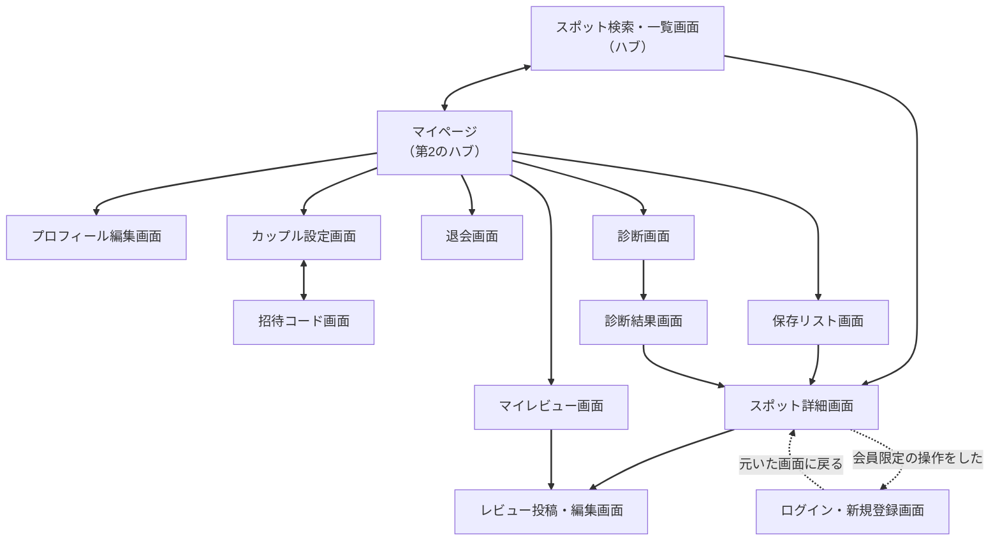
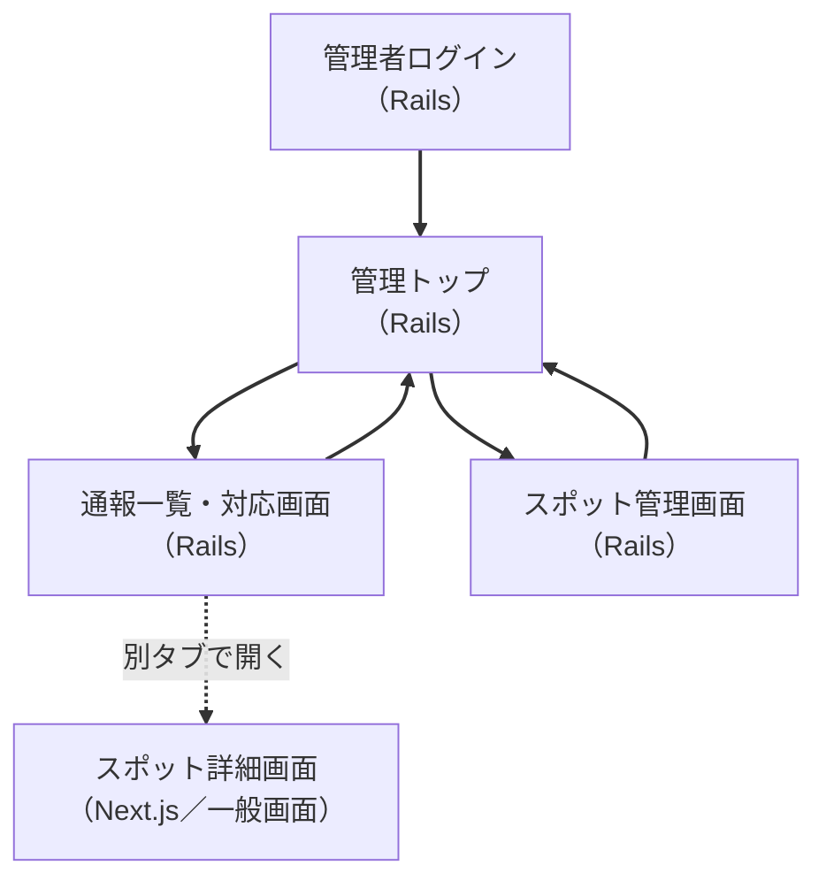
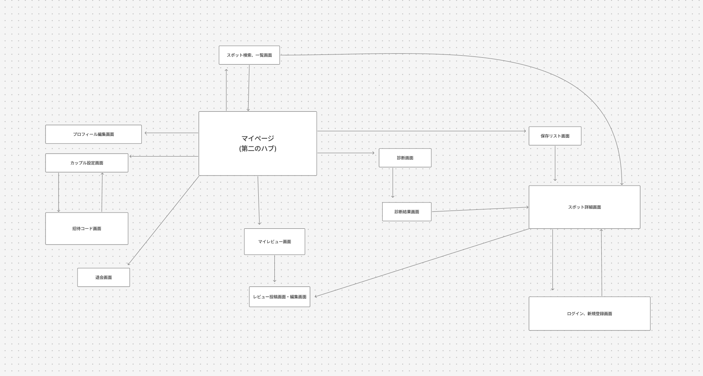

# 画面遷移図

- **最終更新**：2026-07-31
- **前提ドキュメント**：`docs/domain-model.md`、`docs/use-cases.md`
- **本書の範囲**：どんな画面があり、どこからどこへ行けるかを決める。画面の中身は `docs/wireframes.md` で決める

---

## 画面遷移図とは

アプリ全体の**地図**。四角（画面）と矢印（つながり）だけで表す。

先に地図を描く理由は、1画面ずつ作り始めると「この画面からどこに戻るのか」「この画面にはどこから来るのか」で迷子になるため。
全体のつながりを先に決めておけば、各画面が何のための画面かがはっきりする。

**この段階では見た目を考えない。** つながりが正しいかだけに集中する。

---

## 画面一覧

### ゲストも入れる画面

| 画面 | 役割 | どこから来るか |
| --- | --- | --- |
| **スポット検索・一覧画面** | 条件でスポットを探す。**全体のハブ** | 最初の画面 |
| **スポット詳細画面** | 1つのスポットを詳しく見る。レビューを読む | 検索・一覧画面 |
| **ログイン・新規登録画面** | サービスに入る | 会員限定の操作をしようとしたとき |

### 会員の画面

| 画面 | 役割 | どこから来るか |
| --- | --- | --- |
| **マイページ** | 自分に関するものへの入り口。**第2のハブ** | ヘッダー（常時） |
| **プロフィール編集画面** | ニックネーム・エリア・好み・子どもの有無を直す | マイページ |
| **カップル設定画面** | 関係ステージ・記念日・連携状態・連携解除 | マイページ |
| **招待コード画面** | コードの発行・状態確認・入力 | カップル設定画面 |
| **保存リスト画面** | 共有／サプライズを切り替えて見る | マイページ |
| **レビュー投稿・編集画面** | 評価と属性を入力する | スポット詳細画面 |
| **マイレビュー画面** | 自分が書いたレビューと下書きを見る | マイページ |
| **診断画面** | 質問に答える | マイページ |
| **診断結果画面** | 提案されたスポットを見る | 診断画面 |
| **退会画面** | レビューの扱いを選んで退会する | マイページ |

### 管理者の画面

| 画面 | 役割 | どこから来るか |
| --- | --- | --- |
| **管理者ログイン** | 管理画面に入る。一般会員とは別系統 | URLを直接開く |
| **管理トップ** | 管理機能への入り口 | 管理者としてログイン後 |
| **通報一覧・対応画面** | 未対応の通報を確認して対応する | 管理トップ |
| **スポット管理画面** | スポットの登録・編集・非掲載 | 管理トップ |

※ 管理者の画面は **Rails側に持つ**（Next.jsのアプリには含めない）。

---

## 画面遷移図（全体）

※ 各画面からハブへの戻り（ヘッダーのロゴ・戻るボタン）は、すべての画面に存在するため図では省略している。
※ ログイン後の行き先は**元いた画面**とする。割り込みでログインした場合、元の操作を続けられないと離脱につながるため。

### 管理者の画面遷移

管理画面は**Rails側に持つ**。一般利用者向けのNext.jsアプリとは、アプリケーションごと分離する。

**入り口はURLを直接開く。** 一般画面のヘッダーに「管理画面へ」のリンクを置かない。

- リンクを出し分けると、認可の判定が一般画面のあちこちに散る
- 管理者アカウントが乗っ取られた場合に、導線をそのまま与えることになる
- 検索エンジンにインデックスさせない設定を入れる

**認証は一般会員と別系統にする。** セッションを共有しない。

**管理画面から一般画面へは「遷移」させず、別タブで開く。** 通報された投稿を確認した後、管理画面の文脈に戻れなくなるため。

### 補助図

FigJamで作成した配置図を `docs/images/screen-flow.png` に置く。
**上のMermaidが正本**であり、以下は全体の配置を視覚的に把握するための補助である。
遷移を変更した場合は、両方を更新すること。

---

## ポイント

### スポット検索・一覧画面がハブ

ログインの前後を問わず、ここが中心になる。**ゲストでも入れる**のが重要な点で、権限マトリックスで「登録前に価値を体験させ、離脱を減らす」と決めたことが動線に現れている。

多くのサービスはログイン画面が入り口になるが、このサービスはそうしない。

### ログイン画面は「入り口」ではなく「割り込み」

ゲストが保存やレビュー投稿をしようとしたときに初めて現れる。図で点線にしているのはそのため。

**最初に立ちはだかる壁ではなく、必要になったときに出てくるもの**として扱う。

### レビュー投稿はスポット詳細画面からしか行けない

「どのスポットへのレビューか」が決まっていないと投稿できない、というドメインのルールが動線に出ている。マイレビュー画面からは編集にのみ入れる。

### 保存リスト画面のタブは、状態によって変わる

- 連携している：共有／サプライズの2タブ
- **連携していない：サプライズのみ**

共有保存は連携していないとできないが、サプライズ保存はソロでもできる、というドメインのルールがそのまま現れる。

### カップル設定画面は、連携の有無で中身が入れ替わる

- 連携していない：招待コード画面への導線が主役
- 連携している：関係ステージ・記念日・連携解除が主役

**画面としては1つに保つ。** 別画面に分けると、連携した瞬間に画面が消えることになり、地図として不安定になる。

### 診断への入り口は1つだけにする

マイページからのみ入れる。検索・一覧画面からは入れない。

入り口が2つあると、どちらから入っても同じ結果になるのに動線だけが分散する。
**同じ場所に着くなら、入り口は1つでよい。**

### 管理者の画面をRails側に分離する

一般画面に権限で出し分けると、認可の判定が画面のあちこちに散る。非機能要件で「認可の判定を一箇所に集約し、画面ごとの実装差異を生まない」と決めたので、アプリケーションごと分ける。

**管理画面はAPIを経由しない。** これはAPIファーストの方針と矛盾しない。APIファーストはクライアントとサーバの契約に関する方針であり、管理画面はサーバ内部の運営ツールであるため。

ただし**代償が1つある。同じデータに対して経路が2つになる。**
業務ルールをコントローラに書くと、API経由では守られるのに管理画面経由では破れる、という事故が起きる。
ドメイン設計で「ルールは対象物そのものに書く」と決めたのは、まさにこのためである。

---

## OOUI（モノ中心で画面を考える）

> **画面は「やること」ではなく「モノ」を中心に考える。モノごとに、一覧画面と詳細画面がセットである。**

言い換えると、**名詞を先に選ばせて、動詞は後**にする。

| | 動詞が先（タスク指向） | 名詞が先（OOUI） |
| --- | --- | --- |
| 画面 | トップに「レビューを書く」ボタンがあり、押すと「どのスポット？」と聞かれる | スポットを探して詳細を開き、**その画面の中に**「レビューを書く」がある |
| 問題 | 機能を足すたびにボタンが増える。動詞は無限に増える | モノは有限。機能が増えても画面構成が崩れない |

後者が自然なのは、人が「レビューを書きたい」から行動を始めるのではなく、
**「あの店よかったな」と対象を思い浮かべてから行動する**ためである。

ドメイン設計で洗い出した対象物に、一覧と詳細を割り当てる。

| モノ | 一覧画面（見比べる） | 詳細画面（1つを詳しく見る） |
| --- | --- | --- |
| スポット | スポット検索・一覧画面 | スポット詳細画面 |
| レビュー | マイレビュー画面 / スポット詳細内のレビュー一覧 | レビュー投稿・編集画面 |
| 保存 | 保存リスト画面 | （スポット詳細画面へ飛ぶ） |
| 通報 | 通報一覧・対応画面 | （同画面内で開く） |
| 記念日 | カップル設定画面の中の一覧 | （同画面内で編集） |

### 一覧・詳細のセットにしなかったもの

| モノ | 理由 |
| --- | --- |
| **会員** | 他人の会員を見比べる要件がない。マッチングアプリと違い、**人を探すサービスではない** |
| **カップル** | 1人につき最大1つしか存在しない。一覧にする意味がない |
| **招待コード** | 常に1つだけ有効。一覧にならない |
| **診断** | 過去の回答を見比べる要件がない。最新の回答だけを保持する |

**「会員の一覧がない」のがこのサービスの特徴です。** 人ではなく場所を探すサービスであることが、画面構成に出ている。

### あえてタスク指向にした画面

OOUIは迷ったときの初期値であり、絶対の規則ではない。
**手続きそのものが目的の画面**は、モノを選んでから操作する形にすると遠回りになる。

| 画面 | タスク指向にした理由 |
| --- | --- |
| 診断画面・診断結果画面 | 質問に順番に答えること自体が目的。先に選ぶべきモノが存在しない |
| 退会画面 | 確認を重ねる手続き。途中で他の画面に移れる方がむしろ危険 |
| 招待コード画面 | 発行と入力という行為が目的。招待コードは常に1つしか存在せず、選ぶ対象にならない |

**この3つだけが例外である。** 他の画面で同じ形にしたくなったら、モノ中心にできないか先に検討する。

---

## 出しわけが必要な画面

同じ画面でも、状態によって見えるものが変わる。ワイヤーフレームで具体化する。

| 画面 | 出しわけの軸 |
| --- | --- |
| スポット検索・一覧 | ゲスト／会員。会員はステージ・子連れ訪問が初期値として補完される |
| スポット詳細 | 「自分たちに近い条件で見る」が選べるか（ステージ未設定なら選べない） |
| 保存リスト | 連携の有無でタブ数が変わる |
| カップル設定 | 連携の有無で中身が入れ替わる |
| レビュー投稿 | ステージ未設定なら、集計に含まれない旨を表示する |

---

## この段階で判明した論点

| # | 論点 | 内容 |
| --- | --- | --- |
| 1 | ランキングの置き場所 | 機能要件に「ステージ別・エリア別ランキング」があるが、独立した画面にするか、検索・一覧画面の一部にするか未定。**独立画面にすると入り口が増え、ハブが2つに割れる**ため、検索・一覧画面の切り替え表示を推す |
| 2 | 診断結果からの保存 | 診断結果画面から直接保存できるようにするか、スポット詳細を経由させるか |
| 3 | 下書きの扱い | 下書きは「まだレビューではない」ため、マイレビュー画面のタブでよいかは要検討 |

---

## この後の工程との関係

| 工程 | 決めること |
| --- | --- |
| ワイヤーフレーム | 各画面の中に何を置くか。出しわけの具体形 |
| ER図・DB設計 | 各画面が必要とする情報 |
| API設計 | 各画面が1回で取得すべき内容 |

**画面が増えたら本書に戻る。** 新しい画面をワイヤーフレームだけで足さない。
